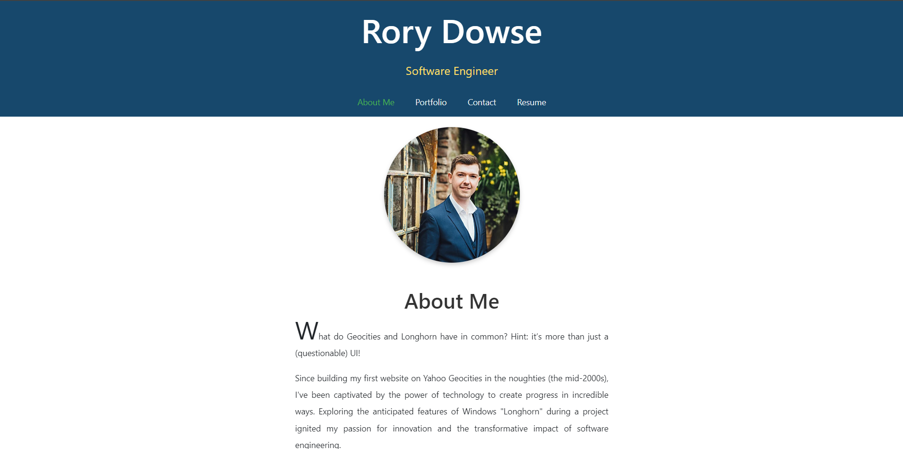

[](https://opensource.org/licenses/MIT)

# Rory Dowse Portfolio

## Description

This project was motivated by the need to create a professional online portfolio that showcases my work and skills to potential employers, clients, and collaborators. I aimed to build a comprehensive platform where visitors can learn about me, explore my projects, and easily contact me. The project serves as a practical demonstration of my React.js abilities, allowing me to test and develop my skills in building dynamic, single-page applications.

Deployed link: https://rory-dowse-portfolio.netlify.app/

## Table of Contents

- [Installation](#installation)
- [Usage](#usage)
- [Screenshot](#screenshot)
- [License](#license)
- [Contributing](#contributing)
- [Tests](#tests)
- [Questions](#questions)

## Installation

1. Clone the repository:
   ```bash
   git clone https://github.com/your-username/your-repository.git
   ```
2. Navigate to the project directory:
   ```bash
   cd your-repository
   ```
3. Install dependencies:
   ```bash
   npm install
   ```
4. Start the development server:
   ```bash
   npm start
   ```

## Usage

1. Navigate through the application using the menu.
2. View the **About Me** page to learn more about me.
3. Explore the **Projects** page and click on any project to view details or visit the deployed application or GitHub repository.
4. Access the **Contact Me** page and interact with the contact form.
5. Visit the **Resume** page to download my resume.

## Screenshot



## License

This project is licensed under the MIT license.

## Contributing

- **Author:**
  [Rory Dowse](https://github.com/RoryDowse)

- **Third-party assets:**
  - [React Router](https://reactrouter.com/en/main/start/tutorial): A library for declarative routing in React applications.
  - [useState](https://react.dev/reference/react/useState): A React hook for managing state in functional components.
  - [React Forms](https://react.dev/learn/reacting-to-input-with-state): A guide on handling user input and form state in React.

## Tests

1. **Manual Testing:**

   - Run your development server:
     ```bash
     npm start
     ```
   - Open your browser and navigate to `http://localhost:3000`.
   - Test different components and functionalities:
     - Verify navigation links and page redirections.
     - Check that forms render correctly and validate inputs.
     - Ensure that links (e.g., resume download) function as expected.

2. **React Hooks and State Management:**
   - Interact with the application to ensure state management and hooks (e.g., `useState`) are working properly:
     - Test input fields to verify state updates.
     - Confirm that validation errors are shown as expected.

## Questions

For more information, visit my GitHub profile: [Rory Dowse](https://github.com/RoryDowse).<br>
For additional questions, please contact me at: [rorydowse@hotmail.com](mailto:rorydowse@hotmail.com).
